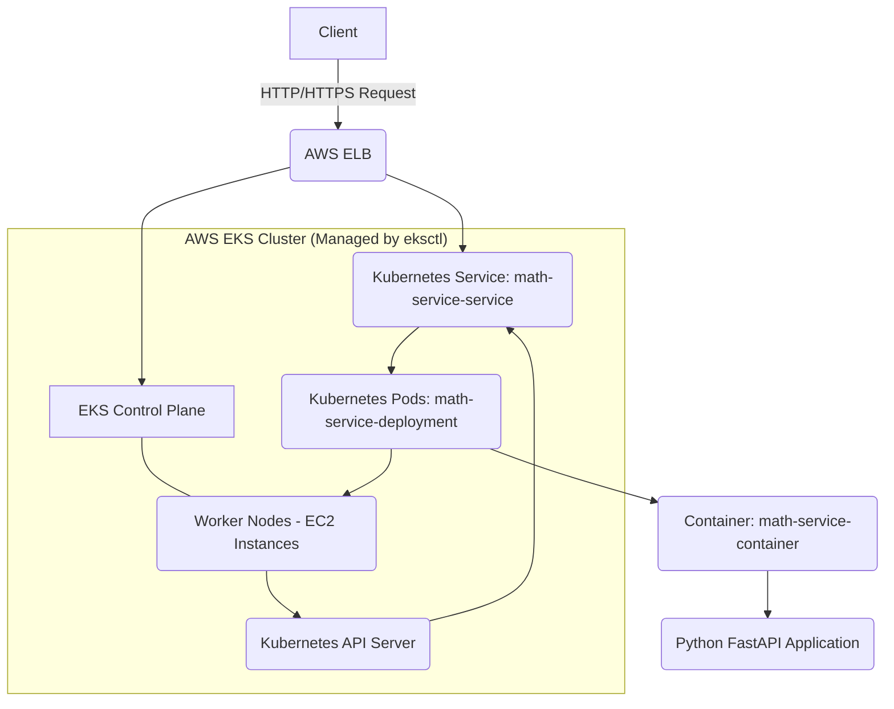

# `math-service`

## Project Overview

The `math-service` is a straightforward Python FastAPI application designed to handle basic arithmetic. It's containerized with Docker and deployed onto an Amazon EKS (Elastic Kubernetes Service) cluster. The EKS cluster itself is provisioned and managed using **`eksctl`**, a command-line tool for Amazon EKS. The application service is made accessible via an AWS Elastic Load Balancer.

This README provides all the necessary instructions for setting up, building, deploying, and testing the `math-service` from scratch, fully leveraging `eksctl` for infrastructure automation.

---

## Architecture Diagram



**Explanation:**

* **Client:** Your local machine or any system initiating requests.
* **AWS ELB (Elastic Load Balancer):** This is provisioned by the Kubernetes `LoadBalancer` Service type and routes external traffic into your Kubernetes cluster.
* **Kubernetes Service (`math-service-service`):** Serves as a stable network endpoint for your pods, load-balancing incoming requests across the healthy instances in your deployment.
* **Kubernetes Pods (`math-service-deployment`):** These are individual instances of your containerized application, managed by a Kubernetes Deployment.
* **Container (`math-service-container`):** The Docker container where your FastAPI application runs.
* **Python FastAPI Application:** Your `service.py` code, responsible for processing mathematical requests.
* **EKS Control Plane:** The managed Kubernetes control plane (API Server, scheduler, controllers, etc.) provided by AWS.
* **Worker Nodes (EC2 Instances):** The underlying EC2 instances that run your Kubernetes pods, provisioned and managed via an Auto Scaling Group by `eksctl`.

---

## Prerequisites

Before you get started, make sure you have the following tools installed and configured:

* **Docker Desktop:** Essential for building and managing Docker images locally.
* **`kubectl`:** The Kubernetes command-line tool, configured to connect to your EKS cluster.
* **AWS CLI:** Configured with credentials that allow you to push images to ECR and manage AWS resources (e.g., `aws configure`).
* **`eksctl`:** The CLI tool for Amazon EKS, used to create and manage the EKS cluster.
* **An AWS Account:** With sufficient permissions to create EKS clusters, VPCs, EC2 instances, and IAM roles.
* **`service.py`:** Your application's Python code, which should be in your project directory.

---

## Setup and Deployment Steps (with `eksctl` Automation)

Follow these steps to get the `math-service` up and running in a new Kubernetes cluster.

### 1. Project Structure

Ensure your project directory is organized like this:

```
.
├── Dockerfile
├── service.py
├── deployment.yaml
├── service.yaml
├── hpa.yaml
└── cluster-config.yaml
```

### 2. Configure Your EKS Cluster with `eksctl`

Create a file named `cluster-config.yaml` in your project root with the following content. This defines your EKS cluster and its node group.

```yaml
# cluster-config.yaml
apiVersion: eksctl.io/v1alpha5
kind: ClusterConfig

metadata:
  name: math-service-cluster # Name of your EKS cluster
  region: eu-west-2 # Choose your AWS region (e.g., eu-west-2)
  version: "1.29" # EKS Kubernetes version (ensure it's supported by eksctl and AWS)

managedNodeGroups: # Or 'nodeGroups' for self-managed ASGs - 'managedNodeGroups' is recommended
  - name: math-service-ng # Name of the node group
    instanceType: t3.medium # Instance type for worker nodes (2 vCPUs, 4 GiB recommended)
                            # Make sure it can handle 1 CPU & 2GiB per pod, and at least 2 nodes.
    desiredCapacity: 2      # Start with 2 worker nodes
    minSize: 1
    maxSize: 3              # Allow for scaling up nodes if needed by Cluster Autoscaler
    volumeSize: 20          # GB disk space for nodes (default is usually 20)
    # You can add a specific SSH key if you want SSH access to your nodes:
    # ssh:
    #   allow: true
    #   publicKeyPath: ~/.ssh/id_rsa.pub # Replace with your SSH public key path
```
**Note on `instanceType`:** The `deployment.yaml` will request `1 CPU` and `2GiB` per pod. A `t3.medium` has 2 vCPUs and 4 GiB memory, which should be sufficient for two pods (one per node, or two on one node) plus system overhead. If you plan for more pods or higher availability, you might consider `t3.large` or `m5.large`, or increase `desiredCapacity`.

### 3. Build the Docker Image

It's vital to build the Docker image specifically for the **`linux/amd64` architecture**. This usually matches your EKS worker nodes and is key to avoiding the "exec format error," especially if you're building on an ARM-based machine (like an Apple M1/M2 Mac).

Navigate to your project's root directory in your terminal:

```bash
# Build the image for linux/amd64 and tag it as 'latest'
docker buildx build --platform linux/amd64 -t my-math-service:latest --load .
```

### 4. Tag and Push the Image to ECR

**Important:** Replace `040296723817.dkr.ecr.eu-west-2.amazonaws.com` with your actual ECR repository URI (including your AWS account ID and region) if it's different. Make sure you have an ECR repository named `my-math-service` created in your account.

```bash
# Tag the image for your ECR repository
docker tag my-math-service:latest 040296723817.dkr.ecr.eu-west-2.amazonaws.com/my-math-service:latest

# Push the image to ECR
docker push 040296723817.dkr.ecr.eu-west-2.amazonaws.com/my-math-service:latest
```

### 5. Create the EKS Cluster with `eksctl`

This command will provision your entire EKS cluster infrastructure on AWS based on `cluster-config.yaml`.

```bash
eksctl create cluster -f cluster-config.yaml
```
* **Execution Time:** This process will take a significant amount of time (typically **20-30 minutes, sometimes more**) as it creates VPC, subnets, NAT Gateways, IAM roles, the EKS control plane, and the worker nodes.
* **Kubeconfig:** Once complete, `eksctl` will automatically configure your `~/.kube/config` file to connect `kubectl` to your new cluster.

### 6. Verify EKS Cluster Status

After `eksctl create cluster` completes, verify that your worker nodes are `Ready` and connected to the cluster:

```bash
kubectl get nodes -w
# Wait until you see your desired number of nodes show a 'Ready' status.
# Press Ctrl+C to exit the watch once ready.
```

### 7. Kubernetes Manifests

Make sure your `deployment.yaml`, `service.yaml`, and `hpa.yaml` files are correctly set up.

#### `deployment.yaml`

This file defines the Kubernetes Deployment for your `math-service` pods.

```yaml
# deployment.yaml
apiVersion: apps/v1
kind: Deployment
metadata:
  name: math-service-deployment
  labels:
    app: math-service
spec:
  replicas: 1 # HPA will manage actual replica count (min: 1)
  selector:
    matchLabels:
      app: math-service
  template:
    metadata:
      labels:
        app: math-service
    spec:
      containers:
      - name: math-service-container
        image: 040296723817.dkr.ecr.eu-west-2.amazonaws.com/my-math-service:latest
        imagePullPolicy: Always # Ensures Kubernetes always pulls the latest image
        ports:
        - containerPort: 8000 # The port your FastAPI app listens on
        env:
        - name: PORT
          value: "8000"
        - name: LOGLEVEL
          value: "INFO"
        resources: # Required: 1 CPU and 2 GiB memory per pod
          requests:
            cpu: "1"   # 1 CPU core (1000m)
            memory: "2Gi" # 2 Gigabytes (2048Mi)
          limits:
            cpu: "1"
            memory: "2Gi"
```

#### `service.yaml`

This file defines the Kubernetes Service to expose your `math-service` externally using an AWS Load Balancer.

```yaml
# service.yaml
apiVersion: v1
kind: Service
metadata:
  name: math-service-service # This name must match the service name in your cluster
  labels:
    app: math-service
spec:
  selector:
    app: math-service # Selects pods with the 'app: math-service' label
  ports:
    - protocol: TCP
      port: 80        # The port the LoadBalancer will listen on (standard HTTP)
      targetPort: 8000 # The port your container is listening on
  type: LoadBalancer    # This will provision an AWS Load Balancer
```

#### `hpa.yaml`

This file defines the Horizontal Pod Autoscaler (HPA) to automatically scale your `math-service-deployment` based on CPU and memory usage.

```yaml
# hpa.yaml
apiVersion: autoscaling/v2
kind: HorizontalPodAutoscaler
metadata:
  name: math-service-hpa
spec:
  scaleTargetRef:
    apiVersion: apps/v1
    kind: Deployment
    name: math-service-deployment
  minReplicas: 1 # Minimum number of pods (as per deployment)
  maxReplicas: 5 # Maximum number of pods to scale up to
  metrics:
  - type: Resource
    resource:
      name: cpu
      target:
        type: Utilization
        averageUtilization: 50 # Target 50% CPU utilization
  - type: Resource
    resource:
      name: memory
      target:
        type: Utilization
        averageUtilization: 60 # Target 60% memory utilization
```

### 8. Deploy Application to Kubernetes

Apply your Kubernetes manifest files using `kubectl`:

```bash
kubectl apply -f deployment.yaml
kubectl apply -f service.yaml
kubectl apply -f hpa.yaml
```

### 9. Verify Application Deployment Status

Monitor your pods and service to confirm they're running as expected:

```bash
# Watch your pods status; they should eventually show 'Running'
kubectl get pods -l app=math-service -w

# Get your LoadBalancer's external IP/Hostname
kubectl get service math-service-service -w

# Wait until 'EXTERNAL-IP' shows a hostname (e.g., a123...elb.amazonaws.com)
# Example output:
# NAME                  TYPE           CLUSTER-IP      EXTERNAL-IP                                                 PORT(S)        AGE
# math-service-service  LoadBalancer   10.100.6.86     a8b36d2294b234c08abaec1a5987091b-960378722.elb.amazonaws.com 80:30473/TCP   5m
```

### 10. Test the Service

Once you have the **`EXTERNAL-IP`** (or hostname) from the `kubectl get service` command, you can test your service by sending a POST request:

```bash
# Replace <EXTERNAL-IP_OR_HOSTNAME> with the actual value you got from kubectl get service
curl -X POST \
     -H "Content-Type: application/json" \
     -d '{"a": 10, "b": 5}' \
     'http://<EXTERNAL-IP_OR_HOSTNAME>/'
```

**Expected Output:**

```json
{"result":15.0}
```

---

## Configuration Explanations

### `Dockerfile`

* **`FROM python:3.11-slim`**: Uses a minimal Python 3.11 base image for efficiency.
* **`RUN apt-get update && apt-get install -y ... pipx`**: Installs essential system dependencies and `pipx`, which is a reliable tool for installing Python applications in isolated environments.
* **`ENV PATH="/root/.local/bin:$PATH"`**: Adds the `pipx` installation directory to the container's PATH, ensuring the `uv` executable is always found.
* **`ARG TARGETPLATFORM` & `RUN ... pipx install uv ...`**: This clever block uses Docker Buildx's `TARGETPLATFORM` variable to ensure `uv` is installed specifically for the **correct target architecture** (like `linux/amd64` for EKS nodes), which is critical for avoiding compatibility errors.
* **`CMD ["uv", "run", "service.py"]`**: The command that starts your FastAPI application using the `uv` web server.

### `service.py` (FastAPI Application)

* Defines a simple FastAPI application that performs basic addition.
* Exposes a **POST** endpoint at the **root path (`/`)**.
* Expects a JSON request body with two float parameters: `a` and `b` (e.g., `{"a": 5.0, "b": 3.0}`).
* Uses `structlog` for structured logging of requests and results.
* Includes `asyncio.sleep(5)` to simulate a long-running operation, which will be useful for observing autoscaling.

### `cluster-config.yaml` (`eksctl` Cluster Configuration)

* **`metadata.name` & `metadata.region`**: Defines the name and AWS region for your EKS cluster.
* **`metadata.version`**: Specifies the Kubernetes version for your EKS control plane.
* **`managedNodeGroups`**: Defines a Managed Node Group for your worker nodes. `eksctl` handles the underlying Auto Scaling Group and EC2 instances.
    * **`name`**: A logical name for your node group.
    * **`instanceType`**: The EC2 instance type (e.g., `t3.medium`).
    * **`desiredCapacity`, `minSize`, `maxSize`**: Controls the scaling behavior of your node group's Auto Scaling Group. `desiredCapacity` is the initial number of nodes, `minSize` is the lowest it can scale down to, and `maxSize` is the highest it can scale up to (if Cluster Autoscaler is deployed and demands more nodes).

### Kubernetes `deployment.yaml`

* **`selector` and `template.metadata.labels`**: These link the Deployment to the pods it manages and allow Services to select them for traffic routing.
* **`image`**: Specifies the Docker image to use for the containers. Ensure this matches your ECR repository URI and the correct tag (`:latest`).
* **`imagePullPolicy: Always`**: This is important during development, especially when using the `:latest` tag. It forces Kubernetes to always pull the image from the registry, bypassing local node caches and ensuring you get the newest version after you push changes.
* **`resources.requests`**: **Crucially**, this specifies the CPU and memory that your pod *requests* from the node. The scheduler uses these values to place pods on nodes with sufficient available resources. For this task, set to `cpu: "1"` and `memory: "2Gi"`.
* **`resources.limits`**: Defines the maximum CPU and memory that your container is allowed to consume. If a container exceeds its memory limit, it will be terminated. If it exceeds its CPU limit, its CPU usage will be throttled.

### Kubernetes `service.yaml`

* **`type: LoadBalancer`**: This is a Kubernetes Service type that, when deployed on a cloud provider like AWS, automatically provisions an external Load Balancer. This Load Balancer then routes incoming traffic to your service.
* **`selector`**: Matches the `app: math-service` label on your pods to correctly direct incoming traffic to them.
* **`port`**: The port that the LoadBalancer will expose (e.g., standard HTTP port 80).
* **`targetPort`**: The internal port that your application container is listening on (e.g., port 8000, as configured in your `service.py`).

### Kubernetes `hpa.yaml`

* **`scaleTargetRef`**: Links the HPA to your `math-service-deployment`.
* **`minReplicas` & `maxReplicas`**: Defines the minimum and maximum number of pods that the HPA can scale the deployment to.
* **`metrics`**: Specifies the criteria for scaling. Here, it targets 50% average CPU utilization and 60% average memory utilization across all pods in the deployment. If these targets are exceeded, the HPA will increase the number of pods (up to `maxReplicas`).

---

## Cost Management and Cluster Shutdown

To manage costs, you can either completely delete the cluster (removing all associated AWS resources) or temporarily scale down your worker nodes.

### Option 1: Full Cluster Deletion (Recommended for long-term shutdown)

This is the most complete way to stop all costs associated with your EKS cluster, as it removes the control plane, worker nodes, and associated networking resources.

```bash
eksctl delete cluster -f cluster-config.yaml
```
* **Execution Time:** This will take a significant amount of time (15-25 minutes) to tear down all resources.
* **Implication:** When you want to use the cluster again, you'll need to recreate it using `eksctl create cluster -f cluster-config.yaml`, and then re-deploy your application.

### Option 2: Temporary Node Scale-Down (For short-term cost saving, keeping control plane)

If you only want to turn off the worker nodes for a short period (e.g., overnight) and keep the EKS control plane running (which incurs a small hourly cost), you can scale down your node group to zero:

```bash
eksctl scale nodegroup \
    --cluster math-service-cluster \
    --name math-service-ng \
    --nodes 0 \
    --region eu-west-2
```
* **Verification:** `kubectl get nodes` should show no nodes after a few minutes.
* **To Scale Back Up:**
    ```bash
    eksctl scale nodegroup \
        --cluster math-service-cluster \
        --name math-service-ng \
        --nodes 2 \ # Or your desired number of nodes
        --region eu-west-2
    ```
    * **Important:** If you use this method, you might need to re-apply your `deployment.yaml`, `service.yaml`, and `hpa.yaml` again once the nodes are back up, especially if pods failed to reschedule or the Load Balancer IP changed due to AWS internal mechanisms.

---

## Troubleshooting

Here are some common issues you might encounter during deployment and testing, along with their solutions:

* **`eksctl create cluster` fails or hangs:**
    * **Reason:** This can be due to AWS permissions issues, network configuration problems, or temporary AWS service outages.
    * **Solution:** Check the CloudFormation console in AWS for detailed error messages in the stack events. Ensure your AWS CLI credentials have sufficient permissions (`AdministratorAccess` for testing, or a specific set of EKS/VPC/IAM permissions for production).
* **`exec /usr/local/bin/uv: exec format error` (in pod logs):**
    * **Reason:** The `uv` executable included in your Docker image is compiled for a different CPU architecture than your EKS worker nodes (e.g., an ARM64 `uv` binary is trying to run on an x86_64 node).
    * **Solution:** Rebuild your Docker image specifically for the correct target architecture using `docker buildx build --platform linux/amd64 ...`.
* **`/bin/sh: uv: command not found` (in pod logs):**
    * **Reason:** The `uv` executable was not found in the container's `PATH` environment variable at runtime.
    * **Solution:** Ensure your `Dockerfile` includes `ENV PATH="/root/.local/bin:$PATH"` after `pipx install uv`.
* **Pods stuck in `Pending`:**
    * **Reason:** No nodes have enough available CPU or memory (based on `requests` in `deployment.yaml`) to schedule the pod, or there are no nodes in the cluster at all.
    * **Solution:**
        1.  Check `kubectl get nodes` to ensure nodes are `Ready`.
        2.  Check `kubectl describe pod <pod-name>` for scheduling events.
        3.  Ensure your `eksctl` node group has enough `desiredCapacity` and appropriate `instanceType` to support your pod requests.
* **`kubectl get service math-service-service` doesn't show `EXTERNAL-IP` for a long time:**
    * **Reason:** AWS takes time to provision the Load Balancer (usually 2-5 minutes). Or, there might be issues with EKS's Load Balancer controller, VPC security groups, or network ACLs preventing external access.
    * **Solution:** Be patient. Check `kubectl describe service math-service-service` for events. Ensure your worker node security groups allow traffic from the ELB, and that your subnets are correctly configured for public Load Balancers.