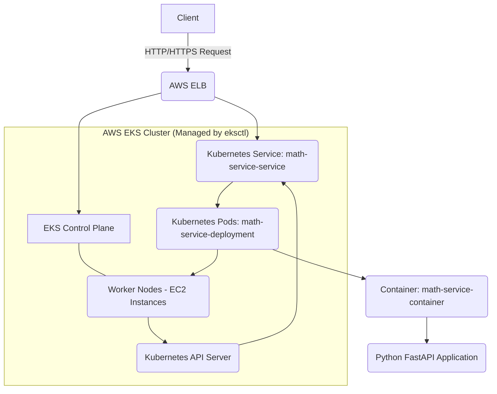

# `math-service`

## Project Overview

The `math-service` is a straightforward Python FastAPI application designed to handle basic arithmetic. It's containerized with Docker and deployed onto an Amazon EKS (Elastic Kubernetes Service) cluster. The EKS cluster itself is provisioned and managed using **`eksctl`**, a command-line tool for Amazon EKS. The application service is made accessible via an AWS Elastic Load Balancer.

This README provides all the necessary instructions for setting up, building, deploying, and testing the `math-service` from scratch, fully leveraging `eksctl` for infrastructure automation.

---

## Architecture Diagram



**Explanation:**

* **Client:** Your local machine or any system initiating requests.
* **AWS ELB (Elastic Load Balancer):** This is provisioned by the Kubernetes `LoadBalancer` Service type and routes external traffic into your Kubernetes cluster.
* **Kubernetes Service (`math-service-service`):** Serves as a stable network endpoint for your pods, load-balancing incoming requests across the healthy instances in your deployment.
* **Kubernetes Pods (`math-service-deployment`):** These are individual instances of your containerized application, managed by a Kubernetes Deployment.
* **Container (`math-service-container`):** The Docker container where your FastAPI application runs.
* **Python FastAPI Application:** Your `service.py` code, responsible for processing mathematical requests.
* **EKS Control Plane:** The managed Kubernetes control plane (API Server, scheduler, controllers, etc.) provided by AWS.
* **Worker Nodes (EC2 Instances):** The underlying EC2 instances that run your Kubernetes pods, provisioned and managed via an Auto Scaling Group by `eksctl`.

---

## Prerequisites

Before you get started, make sure you have the following tools installed and configured:

* **Docker Desktop:** Essential for building and managing Docker images locally. Ensure `buildx` is enabled for cross-platform builds.
* **`kubectl`:** The Kubernetes command-line tool, configured to connect to your EKS cluster.
* **AWS CLI:** Configured with credentials that allow you to push images to ECR and manage AWS resources (e.g., `aws configure`).
* **`eksctl`:** The CLI tool for Amazon EKS, used to create and manage the EKS cluster.
* **An AWS Account:** With sufficient permissions to create EKS clusters, VPCs, EC2 instances, and IAM roles.
* **`locust`:** A Python-based load testing tool. Install it using `pip install locust`.

---

## Setup and Deployment Steps (with `eksctl` Automation)

Follow these steps to get the `math-service` up and running in a new Kubernetes cluster.

### 1. Project Structure

Ensure your project directory is organized like this:

```
.
├── Dockerfile
├── service.py
├── deployment.yaml
├── service.yaml
├── hpa.yaml
├── cluster-config.yaml
└── locustfile.py
```

### 2. Configure Your EKS Cluster with `eksctl`

Create a file named `cluster-config.yaml` in your project root with the following content. This defines your EKS cluster and its node group.

```yaml
# cluster-config.yaml
apiVersion: eksctl.io/v1alpha5
kind: ClusterConfig
metadata:
  name: math-service-cluster # Name of your EKS cluster
  region: eu-west-2 # Choose your AWS region (e.g., eu-west-2)
  version: "1.29" # EKS Kubernetes version (ensure it's supported by eksctl and AWS)
managedNodeGroups:
- name: standard-workers # Name of the node group
  instanceType: t3.large # Larger instance type for worker nodes (2 vCPUs, 8 GiB)
  desiredCapacity: 2     # Start with 2 worker nodes
  minSize: 2             # Minimum of 2 worker nodes will be maintained by ASG
  maxSize: 3             # Max of 3 worker nodes, allowing Cluster Autoscaler to add one
  volumeSize: 20
  labels: {role: worker}
  tags:
    nodegroup-type: standard
```
**Note on `instanceType`:** A `t3.large` instance has 2 vCPUs and 8 GiB memory. Given your deployment requests 1 CPU and 2 GiB memory per pod and your deployment starts with 2 replicas, this instance type provides ample resources for the initial pods and allows for future scaling.

### 3. Build the Docker Image

It's vital to build the Docker image specifically for the **`linux/amd64` architecture**. This usually matches your EKS worker nodes and is key to avoiding the "exec format error," especially if you're building on an ARM-based machine (like an Apple M1/M2 Mac).

Navigate to your project's root directory in your terminal:

```bash
# Build the image for linux/amd64 and tag it as 'latest'
docker buildx build --platform linux/amd64 -t my-math-service:latest --load .
```

### 4. Tag and Push the Image to ECR

**Important:** Replace `040296723817.dkr.ecr.eu-west-2.amazonaws.com` with your actual ECR repository URI (including your AWS account ID and region) if it's different. Make sure you have an ECR repository named `my-math-service` created in your account.

```bash
# Tag the image for your ECR repository
docker tag my-math-service:latest [040296723817.dkr.ecr.eu-west-2.amazonaws.com/my-math-service:latest](https://040296723817.dkr.ecr.eu-west-2.amazonaws.com/my-math-service:latest)

# Push the image to ECR
docker push [040296723817.dkr.ecr.eu-west-2.amazonaws.com/my-math-service:latest](https://040296723817.dkr.ecr.eu-west-2.amazonaws.com/my-math-service:latest)
```

### 5. Create the EKS Cluster with `eksctl`

This command will provision your entire EKS cluster infrastructure on AWS based on `cluster-config.yaml`.

```bash
eksctl create cluster -f cluster-config.yaml
```
* **Execution Time:** This process will take a significant amount of time (typically **20-30 minutes, sometimes more**) as it creates VPC, subnets, NAT Gateways, IAM roles, the EKS control plane, and the worker nodes.
* **Kubeconfig:** Once complete, `eksctl` will automatically configure your `~/.kube/config` file to connect `kubectl` to your new cluster.

### 6. Verify EKS Cluster Status

After `eksctl create cluster` completes, verify that your worker nodes are `Ready` and connected to the cluster:

```bash
kubectl get nodes -w
# Wait until you see your desired number of nodes show a 'Ready' status.
# Press Ctrl+C to exit the watch once ready.
```

### 7. Kubernetes Manifests

Make sure your `deployment.yaml`, `service.yaml`, and `hpa.yaml` files are correctly set up.

#### `deployment.yaml`

This file defines the Kubernetes Deployment for your `math-service` pods.

```yaml
# deployment.yaml
apiVersion: apps/v1
kind: Deployment
metadata:
  name: math-service-deployment
  labels:
    app: math-service
spec:
  replicas: 2 # Initial replicas. HPA will manage actual replica count (min: 1)
  selector:
    matchLabels:
      app: math-service
  template:
    metadata:
      labels:
        app: math-service
    spec:
      containers:
      - name: math-service-container
        image: [040296723817.dkr.ecr.eu-west-2.amazonaws.com/my-math-service:latest](https://040296723817.dkr.ecr.eu-west-2.amazonaws.com/my-math-service:latest)
        imagePullPolicy: Always # Ensures Kubernetes always pulls the latest image
        ports:
        - containerPort: 8000 # The port your FastAPI app listens on
        env:
        - name: PORT
          value: "8000"
        - name: LOGLEVEL
          value: "INFO"
        resources:
          requests:
            cpu: "1"   # 1 CPU core (1000m)
            memory: "2Gi" # 2 Gigabytes (2048Mi)
          limits:
            cpu: "2"   # Max 2 CPU cores
            memory: "4Gi" # Max 4 Gigabytes
        livenessProbe: # Checks if the container is still running
          tcpSocket:
            port: 8000
          initialDelaySeconds: 10
          periodSeconds: 5
          timeoutSeconds: 3
          failureThreshold: 3
        readinessProbe: # Checks if the container is ready to serve traffic
          tcpSocket:
            port: 8000
          initialDelaySeconds: 15
          periodSeconds: 5
          timeoutSeconds: 3
          failureThreshold: 3
```

#### `service.yaml`

This file defines the Kubernetes Service to expose your `math-service` externally using an AWS Load Balancer. It includes specific annotations for the AWS ELB health checks, targeting the dedicated `/healthz` endpoint.

```yaml
# service.yaml
apiVersion: v1
kind: Service
metadata:
  name: math-service-service # This name must match the service name in your cluster
  labels:
    app: math-service
  annotations:
    # ELB Health Check configuration - CRITICAL for correct routing
    service.beta.kubernetes.io/aws-load-balancer-healthcheck-protocol: http
    service.beta.kubernetes.io/aws-load-balancer-healthcheck-path: /healthz # Health check endpoint
    service.beta.kubernetes.io/aws-load-balancer-healthcheck-timeout: "6"
    service.beta.kubernetes.io/aws-load-balancer-healthcheck-unhealthy-threshold: "5"
    service.beta.kubernetes.io/aws-load-balancer-healthcheck-healthy-threshold: "3"
    service.beta.kubernetes.io/aws-load-balancer-healthcheck-interval: "10"
spec:
  selector:
    app: math-service # Selects pods with the 'app: math-service' label
  ports:
    - protocol: TCP
      port: 80        # The port the LoadBalancer will listen on (standard HTTP)
      targetPort: 8000 # The port your container is listening on
  type: LoadBalancer    # This will provision an an AWS Load Balancer
```

#### `hpa.yaml`

This file defines the Horizontal Pod Autoscaler (HPA) to automatically scale your `math-service-deployment` based on CPU and memory usage. The targets are set very low to aggressively demonstrate scaling.

```yaml
# hpa.yaml
apiVersion: autoscaling/v2
kind: HorizontalPodAutoscaler
metadata:
  name: math-service-hpa
spec:
  scaleTargetRef:
    apiVersion: apps/v1
    kind: Deployment
    name: math-service-deployment # Target your deployment
  minReplicas: 1 # Minimum number of pods
  maxReplicas: 5 # Maximum number of pods (adjust as needed for testing)
  metrics:
  - type: Resource
    resource:
      name: cpu
      target:
        type: Utilization
        averageUtilization: 2 # Target 2% average CPU utilization
  - type: Resource
    resource:
      name: memory
      target:
        type: Utilization
        averageUtilization: 4 # Target 4% average memory utilization
```

### 8. Deploy Application to Kubernetes

Apply your Kubernetes manifest files using `kubectl`:

```bash
kubectl apply -f deployment.yaml
kubectl apply -f service.yaml
kubectl apply -f hpa.yaml
```
* **Force Restart/Rolling Update:** If you update your Docker image (especially with the `:latest` tag), run `kubectl rollout restart deployment/math-service-deployment` to force new pods to be created with the updated image.

### 9. Verify Application Deployment Status

Monitor your pods and service to confirm they're running as expected:

```bash
# Watch your pods status; they should eventually show '1/1 Running'
kubectl get pods -l app=math-service -o wide -w

# Get your LoadBalancer's external IP/Hostname
kubectl get service math-service-service -w

# Wait until 'EXTERNAL-IP' shows a hostname (e.g., a123...elb.amazonaws.com)
# Example output:
# NAME                  TYPE           CLUSTER-IP      EXTERNAL-IP                                                 PORT(S)        AGE
# math-service-service  LoadBalancer   10.100.6.86     a8b36d2294b234c08abaec1a5987091b-960378722.elb.amazonaws.com 80:30473/TCP   5m
```

### 10. Test the Service (Manual Curl)

Once you have the **`EXTERNAL-IP`** (or hostname) from the `kubectl get service` command, you can test your service by sending a POST request:

```bash
# Replace <EXTERNAL-IP_OR_HOSTNAME> with the actual value you got from kubectl get service
curl -X POST \
     -H "Content-Type: application/json" \
     -d '{"a": 10, "b": 5}' \
     'http://<EXTERNAL-IP_OR_HOSTNAME>/'
```

**Expected Output:**

```json
{"result":15.0}
```
* **Note:** Due to the `asyncio.sleep(5)` in the `service.py`, this command will take approximately 5 seconds to return the result.

---

## Load Testing with Locust

To observe the Horizontal Pod Autoscaler (HPA) in action and understand your service's performance under load, use Locust.

### 1. Create `locustfile.py`

This is your current `locustfile.py` setup to simulate users sending POST requests.

```python
# locustfile.py
from locust import HttpUser, task, between
import json

class MathServiceUser(HttpUser):
    """
    User class that does a POST request to the math-service.
    """
    # Simulate user think time between requests.
    # This means each "user" will wait between 1 and 2 seconds after completing a request
    # before making the next one. Adjust as needed.
    wait_time = between(1, 2)

    @task
    def add_numbers(self):
        """
        Sends a POST request to the / endpoint with sample data.
        """
        payload = {"a": 10, "b": 5}
        headers = {"Content-Type": "application/json"}
        # The '/' path refers to the root endpoint of your FastAPI service
        response = self.client.post("/", data=json.dumps(payload), headers=headers)

        # Optional: Add validation if response is not 200 OK
        if response.status_code != 200:
            print(f"Request failed with status code: {response.status_code}, response: {response.text}")
        else:
            # You can also add assertions for the response content if desired
            pass
```

### 2. Run Locust

1.  **Get your Load Balancer Hostname:**
    ```bash
    kubectl get service math-service-service -o jsonpath='{.status.loadBalancer.ingress[0].hostname}'
    ```
    Copy the hostname that this command returns.

2.  **Start the Locust UI:**
    Open your terminal in the directory where you saved `locustfile.py` and run:

    ```bash
    locust -H http://<YOUR_ELB_HOSTNAME> # IMPORTANT: DO NOT include a trailing slash here.
                                          # Example: locust -H [http://a4bc356df353049088795480944a7996-148731408.eu-west-2.elb.amazonaws.com](http://a4bc356df353049088795480944a7996-148731408.eu-west-2.elb.amazonaws.com)
    ```

3.  **Access the Locust Web UI:**
    Open your web browser and go to `http://localhost:8089` (or whatever address Locust indicates).

4.  **Configure and Start the Test:**
    * In the Locust UI, enter the **Number of users to simulate** (start with `50` or `100`, then increase).
    * Enter the **Spawn rate** (users/second, e.g., `5` or `10`).
    * Click "Start swarming".

### 3. Monitor Scaling

Keep the following commands running in separate terminals to observe your cluster's behavior:

* **Watch HPA Status:**
    ```bash
    watch -n 10 "kubectl get hpa"
    # Alternatively, a manual loop:
    # while true; do clear; echo "--- $(date) ---"; kubectl get hpa; sleep 10; done
    ```
    * Observe the `TARGETS` (CPU/Memory utilization) and `REPLICAS` (number of pods HPA manages).
* **Watch Pods Status:**
    ```bash
    kubectl get pods -l app=math-service -o wide -w
    ```
    * See new pods appear as the HPA scales up and old pods disappear during scale-down.
* **Check Pod Resource Usage:**
    ```bash
    kubectl top pods -l app=math-service --containers
    ```
    * This shows the actual CPU and memory consumption of your running pods.

---

## Configuration Explanations

### `Dockerfile`

```dockerfile
FROM python:3.11-slim

# Install pipx and dependencies for uv
RUN apt-get update && apt-get install -y \
    curl \
    ca-certificates \
    gcc \
    python3-venv \
    pipx \
 && rm -rf /var/lib/apt/lists/*

ENV PATH="/root/.local/bin:$PATH"

# Install uv using pipx
RUN pipx install uv && \
    which uv && \
    uv --version

WORKDIR /app
COPY service.py .

CMD ["uv", "run", "service.py"]
```
* **`FROM python:3.11-slim`**: Uses a minimal Python 3.11 base image for efficiency.
* **`RUN apt-get update && apt-get install -y ... pipx`**: Installs essential system dependencies and `pipx`, which is a reliable tool for installing Python applications in isolated environments.
* **`ENV PATH="/root/.local/bin:$PATH"`**: Adds the `pipx` installation directory to the container's PATH, ensuring the `uv` executable is always found.
* **`RUN pipx install uv ...`**: Installs the `uv` web server. While the original `Dockerfile` also included `ARG TARGETPLATFORM` for cross-compilation, the core issue was ensuring `uv` was correctly installed and on the `PATH`.
* **`CMD ["uv", "run", "service.py"]`**: The command that starts your FastAPI application using the `uv` web server.

### `service.py` (FastAPI Application)

```python
# /// script
# requires-python = "==3.11.*"
# dependencies = [
#   "uvloop>=0.17.0",
#   "fastapi==0.115.8",
#   "uvicorn==0.15.0",
#   "structlog==21.2.0"
# ]
# [tool.env-checker]
# env_vars = [
#   "PORT=8000",
#   "LOGLEVEL=INFO",
# ]
# ///

import uvloop; uvloop.install()
import logging, os
import structlog
from fastapi import FastAPI
from pydantic import BaseModel
import asyncio

# Logging setup
logging.basicConfig(level=os.environ.get("LOGLEVEL", "INFO"))
structlog.configure(
    processors=[
        structlog.stdlib.add_log_level,
        structlog.processors.TimeStamper(fmt="iso"),
        structlog.processors.JSONRenderer(sort_keys=True)
    ],
    context_class=dict,
    logger_factory=structlog.stdlib.LoggerFactory(),
    wrapper_class=structlog.stdlib.BoundLogger,
    cache_logger_on_first_use=True,
)
logger = structlog.get_logger()

# FastAPI app
app = FastAPI(
    title="Simple Math API",
    description="A simple API to perform basic arithmetic operations",
    version="1.0.0"
)

class AddRequest(BaseModel):
    a: float
    b: float

class AddResponse(BaseModel):
    result: float

@app.get("/healthz") # New health check endpoint
async def health_check():
    return {"status": "ok"}

@app.post("/", response_model=AddResponse)
async def add_numbers(request: AddRequest):
    logger.info("Received addition request", a=request.a, b=request.b)
    result = request.a + request.b
    await asyncio.sleep(5)  # Simulate a longish-running operation
    logger.info("Computed result", result=result)
    return {"result": result}

if __name__ == "__main__":
    import uvicorn
    uvicorn.run(app, host="0.0.0.0", port=int(os.environ.get("PORT", 8000)))
```
* Defines a simple FastAPI application that performs basic addition.
* Exposes a **POST** endpoint at the **root path (`/`)**.
* **Includes a GET endpoint at `/healthz`**: This is a dedicated, lightweight endpoint crucial for health checks by the AWS ELB and Kubernetes probes.
* Expects a JSON request body with two float parameters: `a` and `b` (e.g., `{"a": 5.0, "b": 3.0}`).
* Uses `structlog` for structured logging of requests and results.
* Includes `asyncio.sleep(5)` to simulate a long-running operation, which will be useful for observing autoscaling.

### `cluster-config.yaml` (`eksctl` Cluster Configuration)

* **`metadata.name` & `metadata.region`**: Defines the name and AWS region for your EKS cluster.
* **`metadata.version`**: Specifies the Kubernetes version for your EKS control plane.
* **`managedNodeGroups`**: Defines a Managed Node Group for your worker nodes. `eksctl` handles the underlying Auto Scaling Group and EC2 instances.
    * **`name`**: `standard-workers` is the logical name for your node group.
    * **`instanceType`**: `t3.large` is chosen for worker nodes, providing sufficient CPU and memory.
    * **`desiredCapacity`, `minSize`, `maxSize`**: Controls the scaling behavior of your node group's Auto Scaling Group. `desiredCapacity` and `minSize` are both set to `2`, meaning the node group will always maintain at least two worker nodes. `maxSize` is `3`, allowing the cluster autoscaler to add one more node if required by pending pods.

### Kubernetes `deployment.yaml`

* **`replicas: 2`**: The deployment will initially start with two pods, which matches your `minSize` for nodes.
* **`resources.requests`**: Specifies that each pod requests `1` CPU core and `2Gi` of memory from the node. The scheduler uses these values to place pods on nodes.
* **`resources.limits`**: Defines the maximum CPU (`2` cores) and memory (`4Gi`) that your container is allowed to consume. This provides a buffer and prevents resource exhaustion.
* **`livenessProbe` & `readinessProbe`**: These probes are crucial for Kubernetes to manage your pod's lifecycle.
    * **Liveness Probe:** Checks if the container is still running correctly. If it fails, Kubernetes restarts the container.
    * **Readiness Probe:** Checks if the container is ready to serve traffic. If it fails, the pod is removed from the service's endpoints, preventing traffic from being sent to an unready instance. Both target port `8000` via `tcpSocket`.

### Kubernetes `service.yaml`

* **`type: LoadBalancer`**: This Kubernetes Service type automatically provisions an external AWS Elastic Load Balancer (ELB), which routes external traffic to your service.
* **`selector`**: Matches the `app: math-service` label on your pods to correctly direct incoming traffic to them.
* **`port`**: The standard HTTP port `80` that the Load Balancer will listen on.
* **`targetPort`**: The internal port `8000` that your application container is listening on.
* **ELB Health Check Annotations (`service.beta.kubernetes.io/aws-load-balancer-healthcheck-...`)**: These are crucial for configuring how the AWS ELB determines if your pods are healthy. They explicitly set the protocol to `http`, the path to `/healthz` (your dedicated health endpoint), and configure timeouts and thresholds to ensure reliable health reporting. A timeout of `6s` is chosen to be greater than your `asyncio.sleep(5)`.

### Kubernetes `hpa.yaml`

* **`scaleTargetRef`**: Links the HPA to your `math-service-deployment`.
* **`minReplicas` & `maxReplicas`**: Defines the minimum (`1`) and maximum (`5`) number of pods that the HPA can scale the deployment to.
* **`metrics`**: Specifies the scaling criteria. Here, it targets a very low `2%` average CPU utilization and `4%` average memory utilization across all pods. These aggressive targets are useful for quickly demonstrating the HPA's scaling capabilities.

---

## Troubleshooting Common Issues

Here are some common challenges you might encounter during deployment and testing, along with their solutions:

* **`eksctl create cluster` fails or hangs:**
    * **Reason:** This can be due to AWS permissions issues, network configuration problems, or temporary AWS service outages.
    * **Solution:** Check the CloudFormation console in AWS for detailed error messages in the stack events. Ensure your AWS CLI credentials have sufficient permissions (`AdministratorAccess` for testing, or a specific set of EKS/VPC/IAM permissions for production).
* **`exec /usr/local/bin/uv: exec format error` (in pod logs):**
    * **Reason:** The `uv` executable included in your Docker image is compiled for a different CPU architecture than your EKS worker nodes (e.g., an ARM64 `uv` binary is trying to run on an x86_64 node, common if building on an Apple M-series Mac).
    * **Solution:** Rebuild your Docker image specifically for the correct target architecture using `docker buildx build --platform linux/amd64 ...`.
* **Pods stuck in `Pending`:**
    * **Reason:** No nodes have enough available CPU or memory (based on `requests` in `deployment.yaml`) to schedule the pod, or there are no nodes in the cluster at all.
    * **Solution:**
        1.  Check `kubectl get nodes` to ensure nodes are `Ready`.
        2.  Check `kubectl describe pod <pod-name>` for scheduling events.
        3.  Ensure your `eksctl` node group has enough `desiredCapacity` and appropriate `instanceType` to support your pod requests.
* **`kubectl get service math-service-service` doesn't show `EXTERNAL-IP` for a long time:**
    * **Reason:** AWS takes time to provision the Load Balancer (usually 2-5 minutes). Or, there might be issues with EKS's Load Balancer controller, VPC security groups, or network ACLs preventing external access.
    * **Solution:** Be patient. Check `kubectl describe service math-service-service` for events. Ensure your worker node security groups allow traffic from the ELB, and that your subnets are correctly configured for public Load Balancers.
* **`POST // HTTP/1.1" 404 Not Found` in pod logs during Locust test:**
    * **Reason:** This occurs when Locust sends requests to `http://<ELB_HOSTNAME>//` (a double slash). This happens if you specify a trailing slash in the `-H` flag when starting Locust (e.g., `locust -H http://your-elb-hostname/`).
    * **Solution:** When starting Locust, ensure the `-H` flag's value does **not** have a trailing slash: `locust -H http://<YOUR_ELB_HOSTNAME>`.
* **`Unable to connect to the server: net/http: TLS handshake timeout` from `kubectl`:**
    * **Reason:** This typically indicates an issue with `kubectl`'s authentication credentials to the EKS API server. Common causes include expired AWS temporary credentials or local clock skew.
    * **Solution:**
        1.  Refresh your `kubeconfig` and AWS credentials: `aws eks update-kubeconfig --name math-service-cluster --region eu-west-2`.
        2.  Ensure your local machine's system clock is accurate and synchronized.
* **HPA not scaling up despite high Locust user counts (e.g., 10,000 users):**
    * **Reason:** While Locust might report many users, the actual CPU/memory load on your single pod might not be high enough to exceed the `averageUtilization` targets set in your HPA (e.g., 50% CPU). This can happen if your application is highly asynchronous (`asyncio`) and efficient, or if the load generator itself is a bottleneck.
    * **Solution (for demonstration/aggressive scaling):** As implemented in your latest `hpa.yaml`, reduce the `averageUtilization` targets to very low percentages (e.g., `2%` for CPU and `4%` for Memory). This will force the HPA to scale up aggressively even with minimal observed load. Remember to `kubectl apply -f hpa.yaml` after changing it.
    * **Further Investigation (if needed):** If scaling still doesn't happen even with very low targets, investigate the Locust's actual RPS and error rates, and check `kubectl top pods` for precise resource consumption on the pods.

---

## Cost Management and Cluster Shutdown

To manage costs, you can either completely delete the cluster (removing all associated AWS resources) or temporarily scale down your worker nodes.

### Option 1: Full Cluster Deletion (Recommended for long-term shutdown)

This is the most complete way to stop all costs associated with your EKS cluster, as it removes the control plane, worker nodes, and associated networking resources.

```bash
eksctl delete cluster -f cluster-config.yaml
```
* **Execution Time:** This will take a significant amount of time (15-25 minutes) to tear down all resources.
* **Implication:** When you want to use the cluster again, you'll need to recreate it using `eksctl create cluster -f cluster-config.yaml`, and then re-deploy your application.

### Option 2: Temporary Node Scale-Down (For short-term cost saving, keeping control plane)

If you only want to turn off the worker nodes for a short period (e.g., overnight) and keep the EKS control plane running (which incurs a small hourly cost), you can scale down your node group to zero:

```bash
eksctl scale nodegroup \
    --cluster math-service-cluster \
    --name standard-workers \ # Updated nodegroup name
    --nodes 0 \
    --region eu-west-2
```
* **Verification:** `kubectl get nodes` should show no nodes after a few minutes.
* **To Scale Back Up:**
    ```bash
    eksctl scale nodegroup \
        --cluster math-service-cluster \
        --name standard-workers \ # Updated nodegroup name
        --nodes 2 \ # Or your desired number of nodes
        --region eu-west-2
    ```
    * **Important:** If you use this method, you might need to re-apply your `deployment.yaml`, `service.yaml`, and `hpa.yaml` again once the nodes are back up, especially if pods failed to reschedule or the Load Balancer IP changed due to AWS internal mechanisms.
